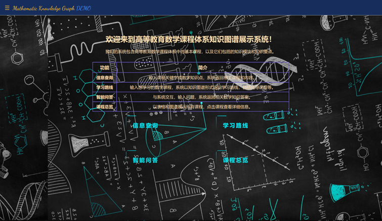
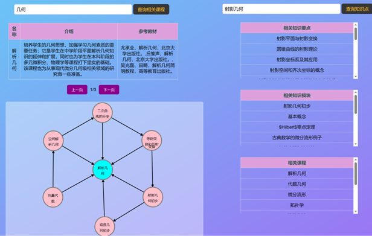
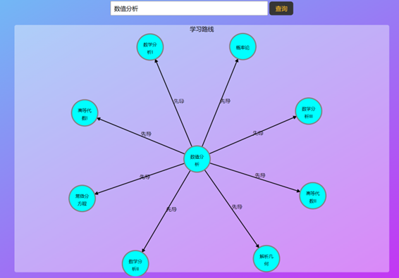
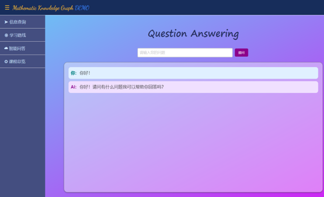
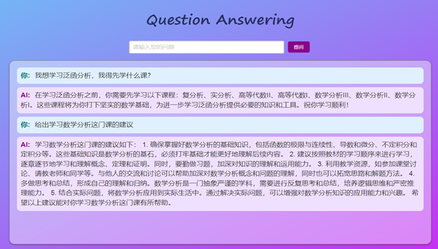
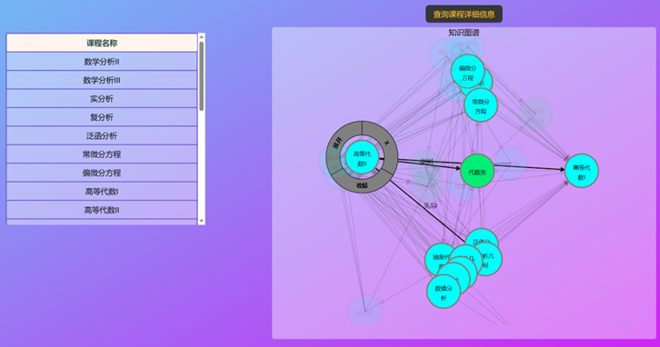

# Mathematical-Courses-Knowledge-Graph

<p align="center">
    
</p>

## 项目名称

高等教育数学课程体系知识图谱

## 项目介绍

本项目构建了一个高等教育数学课程体系知识图谱的Web系统（Demo版），以方便学生、教师、研究人员等人群对高等教育数学课程体系有一个更加直观的认识。

## 项目展示













## 项目结构

```
.
├── README.md
├── neo4j_db // neo4j图数据库
│   ├── data // 数据文件
│   │   ├── 课程模块.csv
│   │   ├── 课程.csv
│   │   ├── 知识模块.csv
│   │   ├── 知识要点.csv
│   ├── __init__.py
│   └── course_graph.py // 生成并初始化图数据库, 并用于后续操作数据库
└── Web // Django Web项目
    ├── manage.py
    ├── Web // Django项目
    │   ├── __init__.py
    │   ├── asgi.py
    │   ├── settings.py
    │   ├── urls.py
    │   └── wsgi.py
    ├── static // 静态文件
    │   ├── css
    │   ├── fonts
    │   ├── img
    │   └── js
    ├── templates // 模板文件
    │   ├── welcome.html
    │   ├── index.html
    │   ├── info_query.html
    │   ├── study_route.html
    │   ├── question_answer.html
    │   ├── courses_overview.html
    │   ├── 404.html
    │   └── 500.html
    ├── Base // Django应用: 基础应用，用于处理一些基础的请求，包括欢迎页面、404、500等
    │   ├── __init__.py
    │   ├── admin.py
    │   ├── apps.py
    │   ├── migrations
    │   ├── models.py
    │   ├── tests.py
    │   ├── urls.py // 路由
    │   ├── backend.py // 复杂的后端处理函数
    │   └── views.py // 视图函数
    ├── KG // Django应用: KnowledgeGraph，用于处理知识图谱相关的基本请求，包括基于知识图谱的实体查询、关系查询等
    │   ├── __init__.py
    │   ├── admin.py
    │   ├── apps.py
    │   ├── migrations
    │   ├── models.py
    │   ├── tests.py
    │   ├── urls.py // 路由
    │   ├── backend.py // 复杂的后端处理函数
    │   └── views.py // 视图函数
    └── QA // Django应用: Question Answering System，用于处理问答系统相关的基本请求
        ├── __init__.py
        ├── admin.py
        ├── apps.py
        ├── migrations
        ├── models.py
        ├── tests.py
        ├── urls.py // 路由
        ├── backend.py // 复杂的后端处理函数
        └── views.py // 视图函数
```

## 项目依赖项

> - Django 4.2.3
> - pandas 2.0.3
> - py2neo 2021.2.3
> - mysqlclient 2.2.0
> - D3.js v5
> - jieba 0.42.1
> - openai 0.27.8
> - urllib3 1.26.16
